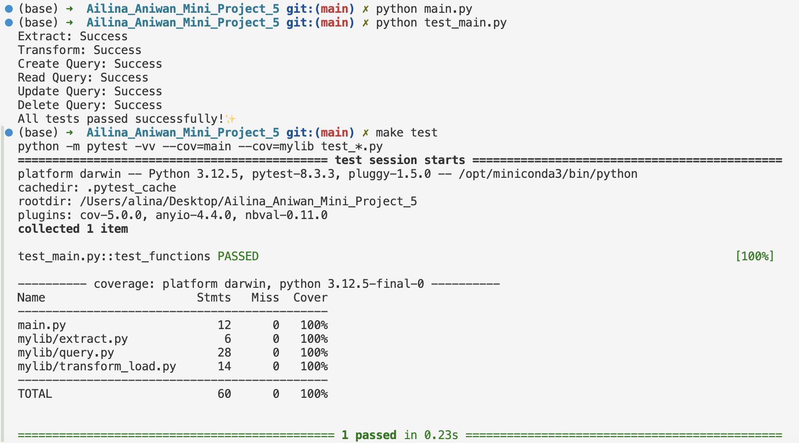

# IDS706 - Mini Project 6 - Ailina Aniwan

## Python Script interacting with SQL Database

## ✔️ Project Overview
This project demonstrates how to interact with a SQLite database using Python. It performs basic CRUD (Create, Read, Update, Delete) operations on a dataset representing women's participation in STEM majors from U.S. colleges.

## ✔️ Project Requirements:
1. **Connect to a SQL database**: Establish a connection to a local SQLite database.
2. **Perform CRUD operations**: Perform Create, Read, Update, and Delete operations on the database.
3. **Write at least two SQL queries**: Write and execute multiple SQL queries, retrieving and updating data.

## ✔️ The Dataset
The dataset used in this project is titled 'Women in STEM Majors,' published by FiveThirtyEight, available [here](https://github.com/fivethirtyeight/data/blob/master/college-majors/women-stem.csv). It contains information about different college majors and the percentage of women in those fields.

## ✔️ Screenshots of Successful Operations

